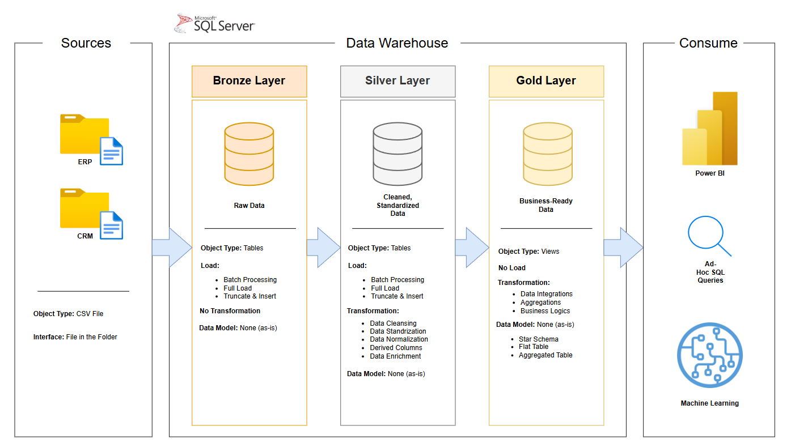

# Data Warehouse and Analytics Project

Welcome to the Data Warehouse and Analytics Project.

Proyek ini mensimulasikan tantangan nyata di industri ritel, di mana data sering kali [terfragmentasi](https://kbbi.portal.id/arti-terfragmentasi) di berbagai sistem seperti ERP (Sales) dan CRM (Customer). **Tujuan utama dari proyek ini** adalah membangun sebuah *Data Warehouse* yang terintegrasi menggunakan **Medallion Architecture (Bronze, Silver, Gold)** untuk menciptakan *Single Source of Truth* guna mendukung pengambilan keputusan bisnis berbasis data.

---
## 🗺️ Data Architecture

Arsitektur ini dibagi menjadi tiga lapisan utama:
1.  **Bronze Layer:** Data mentah (*raw data*) yang diimpor langsung dari file CSV (ERP & CRM).
2.  **Silver Layer:** Tahap pembersihan data (*data cleansing*), standarisasi format, dan penanganan nilai yang hilang/duplikat.
3.  **Gold Layer:** Data yang sudah ditransformasi ke dalam model *star schema* (Fact & Dimension tables) yang siap digunakan untuk analisis.

---

## 📌 Project Requirements

### 1. Building the Data Warehouse (Data Engineering)
#### 🎯 Objective
Membangun data warehouse modern menggunakan **SQL Server** untuk mengonsolidasikan data penjualan, memungkinkan pelaporan analitis yang akurat.

#### ⚙️ Specifications
* **Data Sources:** Import data dari dua sistem sumber (ERP dan CRM) dalam format CSV.
* **Data Quality:** Melakukan *cleansing* dan resolusi isu kualitas data sebelum tahap analisis.
* **Integration:** Menggabungkan kedua sumber data ke dalam satu model data yang *user-friendly* untuk *analytical queries*.
* **Scope:** Fokus pada dataset terbaru (tidak memerlukan historisasi data/SCD untuk saat ini).
* **Documentation:** Menyediakan dokumentasi mengenai model data untuk mendukung para pemangku kepentingan bisnis dan tim analitik.

---

### 2. BI: Analytics & Reporting (Data Analytics)
#### 🎯 Objective
Mengembangkan analitik berbasis SQL untuk menghasilkan *insight* bermakna pada:
* **Customer Behavior:** Analisis demografi dan pola pembelian pelanggan.
* **Product Performance:** Identifikasi produk unggulan dan kategori paling menguntungkan.
* **Sales Trends:** Pemantauan performa penjualan dari waktu ke waktu.

---

## 🛠️ Tech Stack
* **Database:** Microsoft SQL Server
* **Language:** T-SQL (Stored Procedures, Views, CTEs)
* **Tools:** SQL Server Management Studio (SSMS), Git & GitHub

---
*This overview is designed to provide stakeholders with key business metrics, enabling better strategic decision-making.*

---
